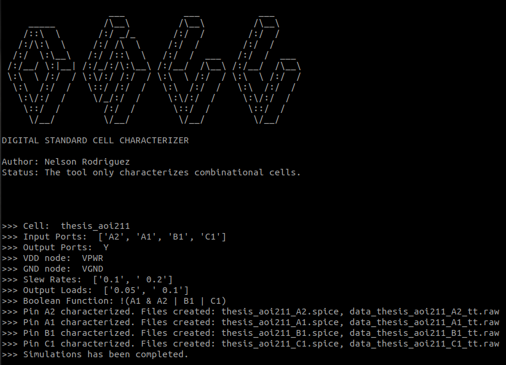

# Digital Standard Cell Characterizer (DSCC)  

 

Python-based electronic design automation (EDA) tool for characterizing digital standard cells designed in [SKY130 PDK](https://skywater-pdk.readthedocs.io/en/main/). The characterization process is based in the [***Synopsys** Liberty User Guides and Reference Manual Suite - Version 2017.06*](Synopsys_Liberty_User_Guides_and_Reference_Manual_Suite_Version_2017.06.pdf) 

> The usage of this tool was documented in section *IV. Characterization / A. Standard Cell Characterization* of ***[Open-Source Standard Cell and I/O Cell Design](./open-source_standard_cell_and_IO_cell_design.pdf)***

***

### ⚠️ Important:
1. **The tool only characterizes combinational cells for nodes greater that or equal to 130nm because it is based on the Non linear delay model (NLDM) for timing characterization. The support for sequential cells will be added in the future.**  
2. **I still have to refactor the code, task I will be doing while I study my courses on Software Development on Coursera.**  
 

## Demo

### 📌 Instructions:
- **The layout file must have the extension `.mag` associated with [Magic Layout Tool](http://opencircuitdesign.com/magic/).**
- **If you installed the PDK in the default path `/usr/local`, it is not necessary to use the argument `--sky130-root`.**
- **The output loads are in picofarads [pF] and the transition times in nanoseconds [ns].**

~~~ bash
python3 dscc.py thesis_aoi211.mag \\
--sky130-root="/home/nelson/cad" \\
--output-loads="0.05, 0.1" \\
--slew-rates="0.1, 0.2"
~~~

 

<b >👇🼠Click on the image to watch the demo</b>

 

<!-- 
<video src="https://github.com/ledzeg/dscc/assets/107968926/7c6d5b47-cb7b-424a-942b-abe0cdf93e18"></video>
 -->

## Slides
**In these slides you will find an explanation on how the tool was developed, that is, the algorithms to characterize the cells and to identify the logical function of them. This tool was developed to be used in the main project of [Open-Source Standard Cell Design Methodology](https://github.com/nelzeg/stdcell-methodology)**
 

<b >👇🼠Click on the image to watch the slides</b>

 

